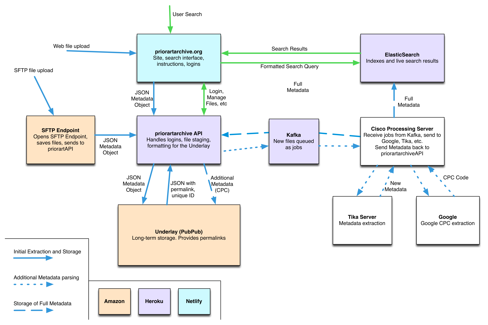

# Prior Art Archive

This repo contains all of the code powering the Prior Art Archive.

The project is broken into several smaller functions which form the heirarchy of our folder structure:

- `/site`: Code for the user-facing frontend
- `/api`: Node API using for logins, and other front-end actions
- `/lambdaParser`: AWS Lambda function for handling new files created by the SFTP server
- `/sftp`: Instructions for managing the SFTP architecture

## Site
**To install:** site dependencies, run `npm install` from the root directory of the repository.

**To develop:** run `npm run start-site` from the root directory of the repository. The dev site will be live at `locahost:8080` and will auto-reload with changes to the code.

Static files such as images, robots.txt, etc are stored in the /static folder. The contents of this folder are copied to the /dist folder during the production build. The contents, not the folder itself, are copied, so that robots.txt, etc will be at the top-level of the deployed application.

### Deploying
The site automatically deploys on new pushes to the dev and master branch on Github. The dev branch triggers new dev builds and the master branch will trigger new production builds. These build configurations and triggers are managed through Netlify, where the site is hosted.

## API

First, create a `config.js` file to configure the values. See `config.sample.js` for an example.

Then run:

```
npm install
npm run start-api
```

### Deploying
The API automatically deploys on new pushes to the dev and master branch on Github. The dev branch triggers new dev builds and the master branch will trigger new production builds. These build configurations and triggers are managed through Heroku, where the api is hosted.

## Lambda Parser
This parser is invoked on each new file in the SFTP filesystem. It extracts metadata andmakes the appropriate API calls to add the new file to the database, and subsequently push it to Kafka.

**To install:** lambda dependencies, run `npm install` from the lambdaParser directory of the repository.

### Deploying
To deploy new Lambda code, you need to compress `index.js`, `node_modules`, and `package.json` into a single .zip archive. This .zip can then be uploaded through the AWS lambda interface. Be sure to use the local `node_modules` folder and `package.json` and not the root ones.

## SFTP
The SFTP architecture is running as an ec2 instance with connection to a s3 bucket.

# Architecture
An early diagram (needs updating as of summer 2018):

